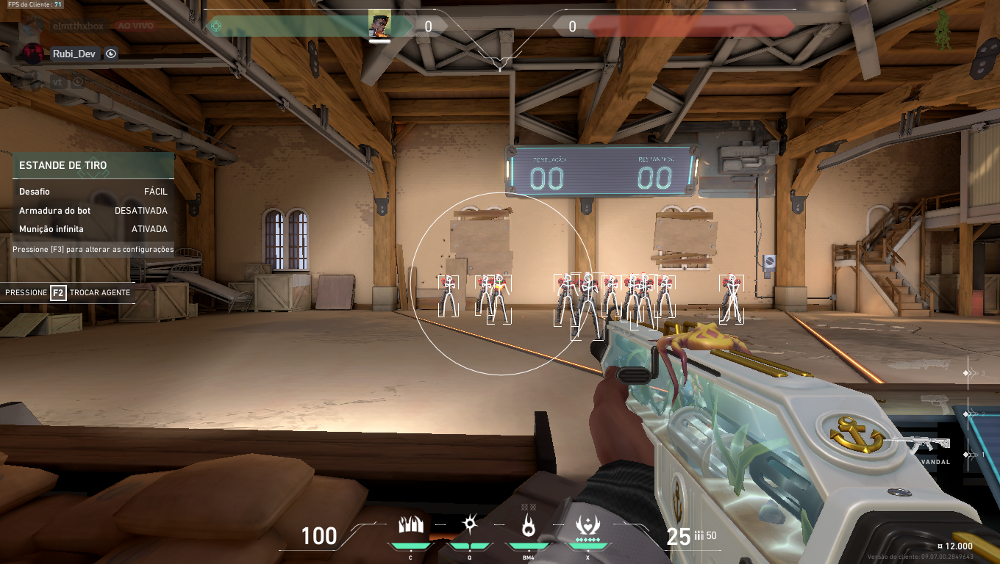
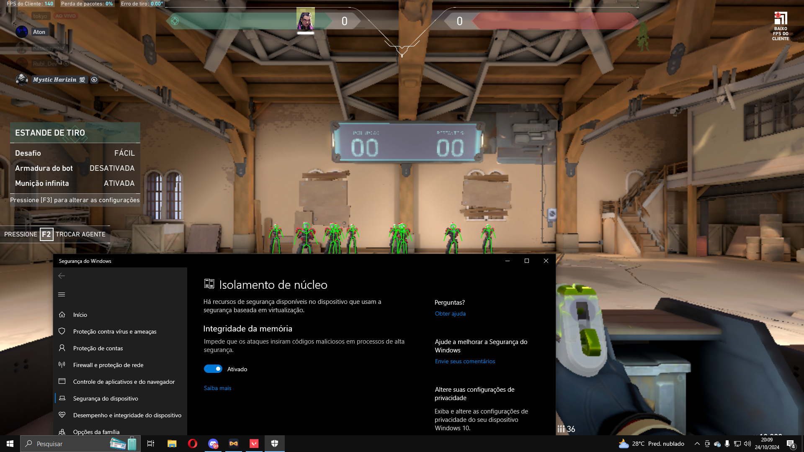

# **VALORANT RUBIAIM V8.0**  

### **ATENÇÃO:**  
Esta versão disponível no GitHub é gratuita, mas possui funcionalidades limitadas e requer configuração manual. Caso deseje acesso à **versão privada completa**, contando com suporte dedicado, driver próprio e segurança reforçada contra o Vanguard, entre em contato:  
📧 **E-mail:** [rubi_dev@vendacheats.com](mailto:rubi_dev@vendacheats.com)  
🌐 **Site:** [rubireseller.vendacheats.com](https://rubireseller.vendacheats.com)  

---

## **O QUE É O RUBIAIM?**  
O **Rubiaim V8** para Valorant é a ferramenta definitiva para melhorar sua experiência no jogo. Desenvolvido para usuários que desejam uma personalização completa, oferece funcionalidades avançadas, como wallhack, assistência de mira (aimbot), e mais!  

### **Destaques da Versão Atual:**  
- 🎯 **Aimbot altamente configurável**  
- 🔒 **Bypass seguro para Vanguard**  
- 🚀 **Injeção simplificada e interface intuitiva**  
- 🔧 **Recoil Control**
- 🎯 **Draw Fov**
- ➕ **Draw Crosshair**
- 👁️ **Visibility Check**
- 🤖 **Smoothing Aim**
- 👀 **Visuals**
- 🟥 **Box(3D Box, 2D Box)**
- 👥 **Team Check**
- 🚫 **Remove Dormant**
- ❤️ **Health**
- 📏 **Snaplines**
- 📐 **Distance**
- 💀 **Skeleton**
- 🎯 **Head Circle**
- 📏 **Max Distance**
- 🎨 **Visible Color / Non Visible Color**
- 🎥 **Stream Mode** (Compatível com streaming, o menu não aparece no OBS)

---

## **COMO CONFIGURAR A VERSÃO GRATUITA**  

1. **Instale o Medal App**: Certifique-se de que ele esteja configurado corretamente para gravar sua tela.  
2. **Inicie o Valorant**: Abra o jogo e deixe-o no **modo janela sem bordas** ou **modo janela**.  
3. **Feche processos conflitantes**: Abra o Gerenciador de Tarefas, localize o processo **RubiAIM** e encerre-o.  
4. **Execute o programa**: Abra novamente o **RubiAIM** e o menu do cheat aparecerá automaticamente no jogo!  
5. **Importante**: Ative o **HVCI** para garantir o funcionamento adequado e maior segurança.

---

## **PRÉ-REQUISITOS**  

- Windows 10/11 com **HVCI ativado** (isolamento de núcleo) 
- **Medal App** configurado e executando em segundo plano  
- Modo janela ou janela sem bordas no Valorant  

---

## **SUPORTE & CONTATO**  
Para dúvidas, suporte ou adquirir a versão privada do **Rubiaim**, entre em contato:  
📧 **E-mail:** [rubi_dev@vendacheats.com](mailto:rubi_dev@vendacheats.com)  
🌐 **Site:** [rubireseller.vendacheats.com](https://rubireseller.vendacheats.com)  

---

## **IMPORTANTE**  

O uso de cheats é contra os Termos de Serviço da Riot Games e pode levar a sanções na conta do jogador. Este software é disponibilizado para fins educacionais e de entretenimento. Use por sua conta e risco.
